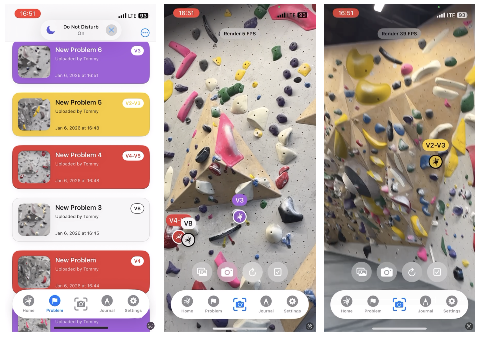
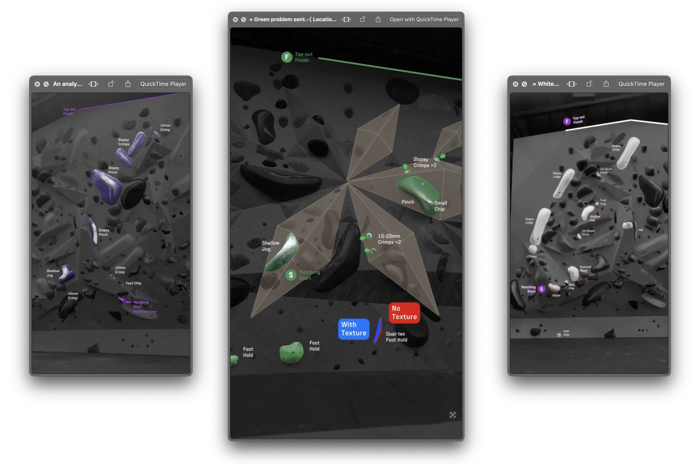
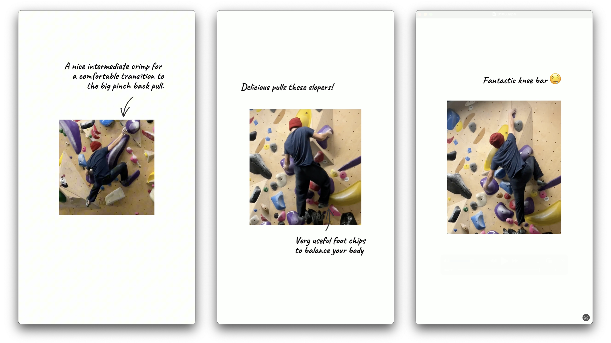

<!-- title: Second gym test at Mosaic -->
<!-- date: 2026-01-06 -->
<!-- category: crux-beta-ios -->

# Second gym test at Mosaic

Added a bunch of stuff today, bells and whistles, mostly minor UI/UX updates and some code refactoring. It felt ready for another round of real testing, so I packed the latest build and headed to Mosaic around 4 PM.

This was my second real gym test session at Mosaic, and it felt very different from the first. I was noticing more friction, subtle UX breakdowns, and moments where the app started to feel heavy instead of helpful–almost drifting in a direction that even I, as a hardcore climber, instinctively felt was off.

---

## Problem detection & reference images

One thing that became obvious almost immediately was how fragile problem detection feels when it relies on **a single reference image**. Using just one angle isn’t enough in a real gym. Not to mention some edges cases like lighting and perspective change too much.

I’m thinking that using multiple reference images from different angles would make detection more reliable.

> **Note:** At the same time, registering **ever** image for **every** problem feels wasteful. A better mental model might be:
> 
> - One reference image per focused problem
> - Let AR lock onto that single problem
> - Highlight the entire route
> 
> Maybe there’s no real need to show all problems at once. it mostly just adds noise. 
> Maybe the AR Camera View should only be opened when the user comes from the Journal and wants to focus on a specific problem.

Performance was the biggest red flag today. 

Once I added more than five problems, FPS dropped noticeably (from ~60 to ~30 to ~10). The AR scene started to feel sluggish, and floating tags took about a second to update while panning around. The whole experience became heavy and laggy. This is worrying, because it clearly doesn’t scale. If AR performance degrades this quickly, the current approach needs to be reconsidered.

### Multi-angle capturing

I also kept thinking about how annoying it is to manually capture multiple reference images. A much smoother approach would be something like a **panorama-style capture**:

- The user pans their phone around the wall
- The system automatically captures multiple frames
- Those frames get stitched into one large reference image

Less effort for the user, better data for detection.

### AR filtering & guidance

In the AR Camera View, it became clear that filtering is essential, i.e., selectively showing some problems instead of showing all.

Users should be able to choose which grade or which grade range appears in AR. The reasoning is that it could reduces clutter and turns AR into a guidance tool–helping climbers decide where to go instead of overwhelming them with everything at once.

---

## Annotation UX: a major pain point!

Annotation UX is still rough. Right now, auto-extracting holds only works once and only works during the initial image flow. Once you enter annotation edit mode:

- You can’t zoom in    
- You can’t tap a specific location
- You can’t auto-extract again
    
This feels genuinely bad. Anything else is just fighting the user.

### Do we want a lof of actions in AR camera view?

This ties into a broader realization: the AR Camera View is overloaded. With all the current and planned features, it’s trying to do too much. AR should focus on:

- In-the-moment climbing support   
- Minimal cognitive load

Anything that doesn’t directly help you climb *right now* probably doesn’t belong there. Floating overlays and tags are part of this problem. They can be obstructive, and sometimes it’s not obvious which problem they’re attached to. This isn’t urgent, but it’s something to revisit later when refining how AR information is presented.

---

## Journal vs. AR

Another big clarity moment: **beta analysis does not belong in AR**. Comparing successful beta vs attempts, video comparison, pose analysis, and understanding failure are reflective activities. These should live in the **Journal tab**.

- AR = action    
- Journal = thinking

Trying to mix the two just adds cognitive load. **I shoud start implement the Journal view ASAP**

### Auto-matching problems from photos in Journal

I also realized how powerful auto-matching could be. If a user takes a photo of the wall, the system should automatically match it to known problems in the database. Manually searching every time is unnecessary friction–especially when computer vision can help here.

### Logging sends with Journal

Journal usability matters more than I expected. What I really want, at the end of a session, is to quickly log my attempts. Kaya makes this surprisingly frustrating: **the flow isn’t intuitive, and logging feels slow.** The journal in this app needs to be:
extremely convenient and fast. Fast logging, quick notes, clear progress tracking. No friction.

### Connect AR to Journal

To bridge AR and reflection better. The Beta Carousel already has **Edit Problem** and **Edit Beta** buttons. Adding a **Journal / Log** button there feels natural. So the flow goes like climb -> log -> reflect, and this should be a smooth transition, not a mental context switch.

### Journal-Style Beta Video Generation

Linking back to the days when I was creating [videos](https://www.instagram.com/p/DE_tR1ExXHE/) using a comprehensive way to explain how my beta works, I’m very excited about the idea of **journal-style beta video generation**. It would combine (1) user beta videos and (2) user notes into a structured, social-media-ready video that explains:

- The beta
- Each movement
- What failed

> Above, maybe it looks something like this.

Adding comic or hand-drawn-style captions would make it both informative and fun; and make Tiktok-able (I don't know what teenagers say nowadays).

## Personal coaching AI?

One idea that kept coming back: a **personal coach**. Something that can say:

- "This is the softest V5"
- "Try this V7 next"

We should not have a free-form chatbot, but an **intent-driven system** that routes user intent into deterministic actions using:

- Personal history
- Community beta
- Comments and feedback

Direction, not conversation.

---

The core takeaway from today feels very clear:

- **AR should help you climb now.**  
- **The Journal should help you understand later.**  
- **Everything else should reduce friction.**

I liked this session. I sent a blue tag, found some bugs, and clarified the philosophy of the product.