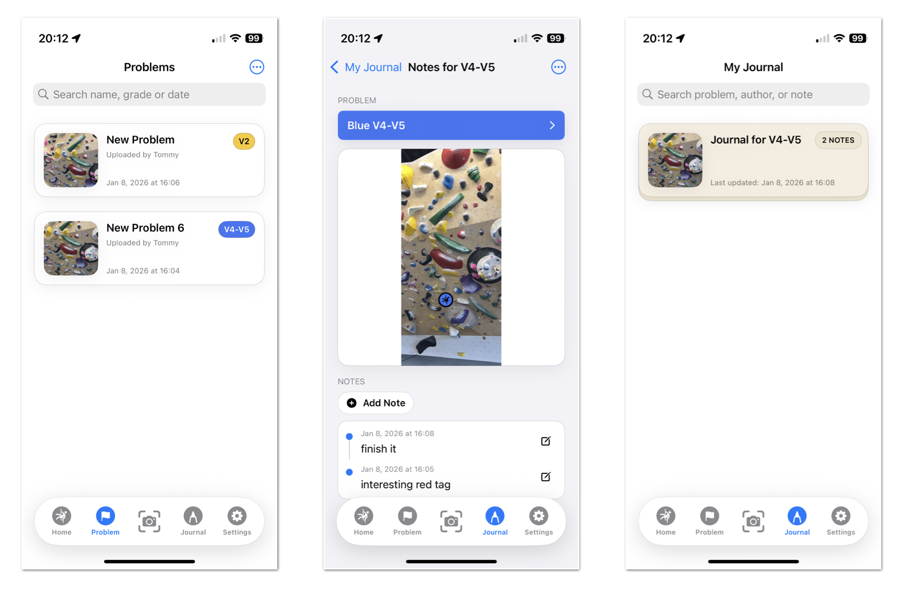
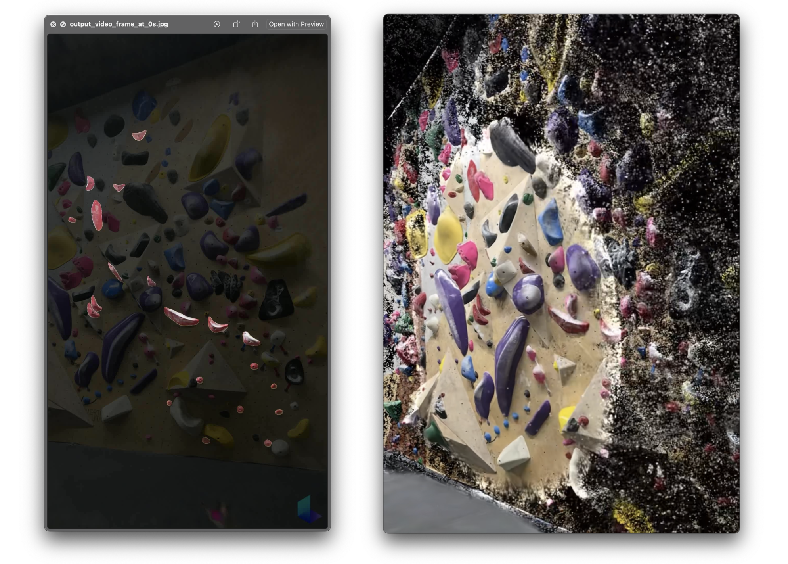

<!-- title: Half way there -->
<!-- date: 2026-01-08 -->
<!-- category: crux-beta-ios -->

# Half way there for beta testing

Finished my third gym test session this afternoon. Met Randy and Diego while they were setting a new wall, super fun set. Today’s versio of the app was more about testing how the **Journal** view/flow should work: 

1. How users use the Journal to log their attempts, and 
2. Which features are actually necessary and convenient. 

Some random thoughts below.

---

I spent more time thinking about the Journal as a first-class surface. Since journals are currently composed of notes tied to problems, it could be really interesting to summarize user-written notes with AI and surface one or two sentences directly on the journal card preview. That would make it easier to understand progress at a glance. As a next step, we could even introduce a more structured way to describe problems, so that an LLM can understand which part of the climb the user is referring to. Maybe it'll allow the app to automatically caption or match what the user said.

Notes themselves also feel like an area with a lot of untapped potential. Right now they’re just plain text, but they could support **voice input** or **simple tags** to make capturing thoughts faster and more natural. Visually, problem detail views could do more to guide attention. For example, I could use brief reveal animations (like how Luma AI [reveals a Gaussian-splatted scene](https://lumalabs.ai/capture/FE1516C7-D0FF-469D-9307-D0ACFC960AA6)), or, use segmentation masks on holds instead of the static badges we have right now. This would help users immediately understand which holds a problem refers to, not just an image box.

---

[SAM2](https://github.com/facebookresearch/sam2) is just fantastic. I implemented a [backend](https://github.com/cruxbetalabs/app-backend/tree/main) that allows the iOS client to send a request with an image and a tap location, and the results are super satisfying and fast. Long-term, the backend should be able to extract holds directly from video, either automatically or with guided interaction, rather than relying solely on reference photo(s). 

Another reminder that the more the system adapts to how climbers naturally move and record sessions, the less friction it creates overall. The app should really understand how users are progressing as they use it.

Great sesh.
